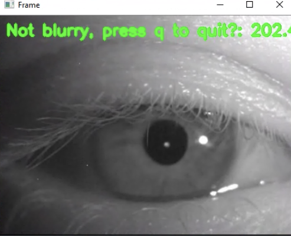
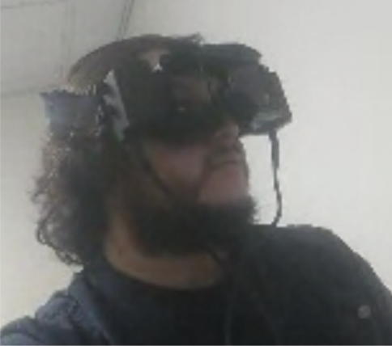

# Blur_Detection
Stream webcam/pupillometry headset data, check if video is in focus and
return a value for how blurry it is.

Created by Erin Tan and Aneesha Kodati as part of the Summer 2020 Middlesex County Academy, Edison, New Jersey, USA Mentorship Program, in collaboration with the Integrative Human Physiology Lab of the Department of Pharmacology, Physiology, and Neuroscience, Rutgers Biomedical Health and Sciences, Newark, New Jersey, USA, and Dr. Komisaruk's Lab of the Department of Psychology, Rutgers University, Newark, New Jersey, USA

Please use the following as citation: 
Tan, Erin & Kodati, Aneesha, Blur_Detection, (2020), GitHib repository, https://github.com/etan18/Blur_Detection.

## Software Setup
- Python 3.7.4
- OpenCV 4.1.1
- ffmpeg-python (optional module to improve stream speed)
- To install module imutils:
```
pip install imutils
```

## Instructions
Open 
```
blur_detection.py
```
- Video should be of just one eye




##### For Testing Purposes
To change default webcam path, change variable PATH on line 31


## Run Code
1. Open Command Line or Terminal Prompt
2. Navigate into Blur_Detection repository
```
cd Path/to/Blur_Detection
```
3. Use python (or python3) command to run blur_detection.py
- To run a specific .mp4 file or webcam, add argument with video address
  - To check for available cameras (for Mac)
  ```
  system_profiler SPCameraDataType
  ```
- If no argument is added, the default is laptop webcam
  - If using webcam, can change default variable PATH (line 31) to location of video
```
python blur_detection.py [optional_video_path]
```
